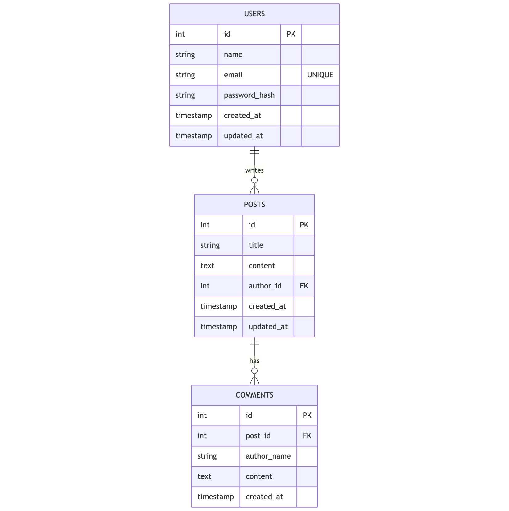

# Take-Home Test for Backend Engineer

**Notice:** You are not required to complete 100% of the task. Please do your best within the given time frame, and focus on demonstrating your skills and approach to problem-solving. We are interested in seeing your thought process and how you tackle the core aspects of the task.

## Task: Building a Simple Blog Platform

Create a RESTful API using Golang that allows users to perform CRUD operations on blog posts and comments, with user registration and login functionality. The data should be stored in a MySQL database.

### Entities

**User**
- id (integer, primary key)
- name (string)
- email (string, unique)
- password_hash (string)
- created_at (timestamp)
- updated_at (timestamp)

**Blog Post**
- id (integer, primary key)
- title (string)
- content (text)
- author_id (integer, foreign key referencing User)
- created_at (timestamp)
- updated_at (timestamp)

**Comment**
- id (integer, primary key)
- post_id (integer, foreign key referencing Blog Post)
- author_name (string)
- content (text)
- created_at (timestamp)

### API Endpoints

**User Registration & Authentication**
- `POST /register` - Register a new user.
- `POST /login` - Login and receive a token for authentication.

**Blog Posts**
- `POST /posts` - Create a new blog post.
- `GET /posts/{id}` - Get blog post details by ID.
- `GET /posts` - List all blog posts.
- `PUT /posts/{id}` - Update a blog post.
- `DELETE /posts/{id}` - Delete a blog post.

**Comments**
- `POST /posts/{id}/comments` - Add a comment to a blog post.
- `GET /posts/{id}/comments` - List all comments for a blog post.

### Database Designs



## Evaluation Criteria

- Code quality and organization.
- Completeness of the required features.
- Security measures (e.g., authentication implementation).
- Creativity and problem-solving approach, especially if modifications to the entities were made.

## Setup Instructions

### Prerequisites

Ensure you have the following installed on your local machine:
- **Go** (version 1.21 or later)
- **Docker** & **Docker Compose**
- **Make** (optional, but recommended for running commands)

### 1. Configuration

Create a `.env` file based on the example provided. This file contains database credentials and configuration.

```bash
cp .env.example .env
```

### 2. Running the Application

#### Option A: Using Docker (Recommended)

1.  **Start the services (MySQL and API):**
    ```bash
    docker-compose up -d --build
    ```

    *Database migrations will be applied automatically by the `migrate` container.*

2.  **Seed Database (Optional):**
    Populate the database with dummy users.
    ```bash
    make seed
    ```

The server will be running at `http://localhost:8080`.

#### Option B: Manual Setup

1.  **Start MySQL:**
    You can use Docker to run just the database.
    ```bash
    docker-compose up -d mysql
    ```

2.  **Run Migrations:**
    ```bash
    make migrate-up
    ```

3.  **Run the API:**
    ```bash
    go run cmd/api/main.go
    ```

### 3. Running Tests

Run the unit tests for the Domain and Usecase layers:

```bash
go test -v ./internal/domain/... ./internal/usecase/...
```

## Submission Instructions

Push your code to a Git repository and send us the link.